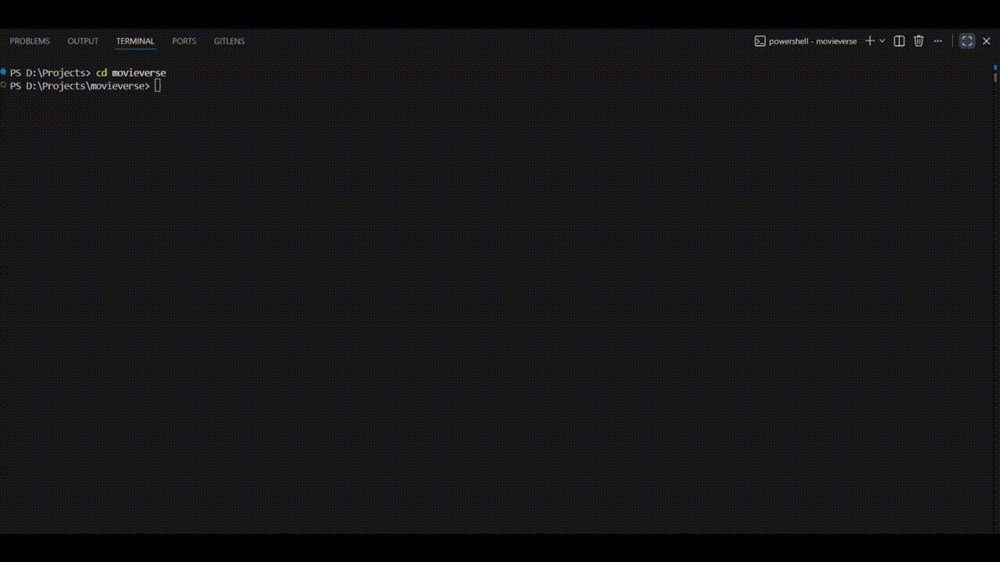
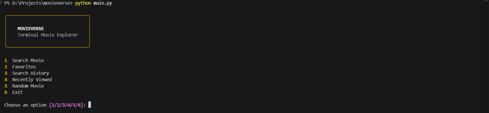
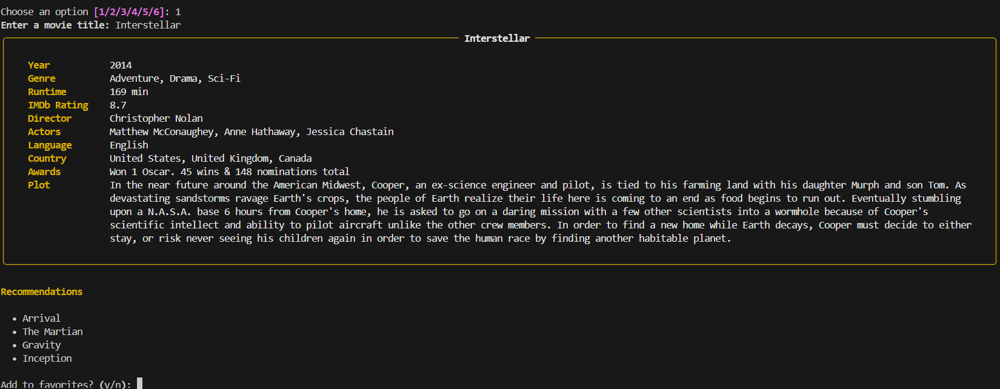
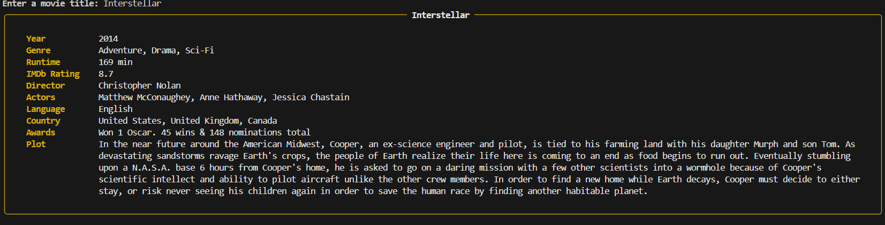
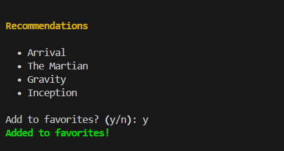
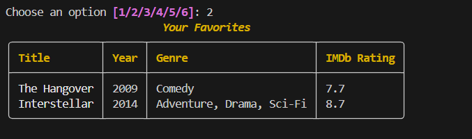
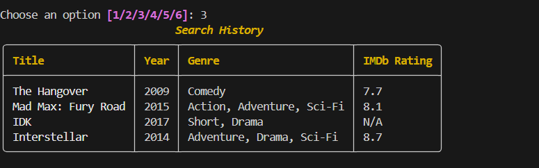
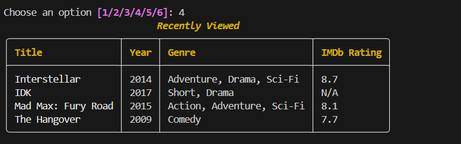
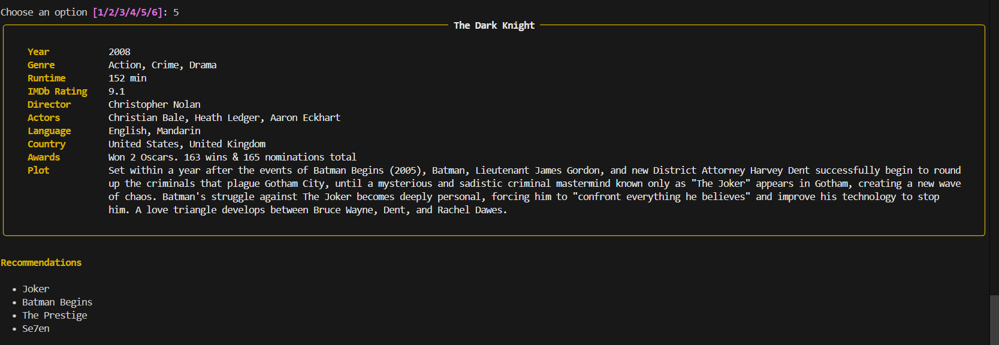

# MovieVerse 🎬

A terminal-based movie explorer built using Python, the OMDb API, and Rich.

This project started as a way to get comfortable working with external APIs, file handling, and structuring a Python project into multiple modules instead of throwing everything into one script. Along the way it became a clean, feature-rich CLI application with persistent local storage and a polished terminal interface.

---

## Features

- Search any movie using the OMDb API
- View detailed movie information
- Get similar movie recommendations
- Save movies to Favorites
- Automatic Search History
- Recently Viewed movies
- Random Movie picker
- Rich-powered terminal interface
- Local JSON storage (no database required)

---

## Demo

<p align="center">
  
</p>

---

## Screenshots

### Main Menu



### Search Movie



### Movie Details



### Recommendations



### Favorites



### Search History



### Recently Viewed



### Random Movie



---

## Project Structure

```text
movieverse/
├── assets/
│   ├── demo.gif
│   └── screenshots/
│       ├── menu.png
│       ├── SearchMovie.png
│       ├── movie-details.png
│       ├── recommendation.png
│       ├── favourites.png
│       ├── history.png
│       ├── recent.png
│       └── random-movie.png
│
├── data/
│   ├── favorites.json
│   └── history.json
│
├── src/
│   ├── api.py            # talks to the OMDb API
│   ├── history.py        # handles history + favorites
│   ├── recommender.py    # genre/title based
│   ├── ui.py             # all the Rich terminal output
│   └── utils.py          # small json helper functions
│
├── main.py
├── requirements.txt
├── .env.example          # contains the API key
├── .gitignore
└── README.md
```

---

## Tech Stack

- Python 3 - requests — for hitting the OMDb API
- rich — for the terminal tables/panels/menu
- python-dotenv — for loading the API key from .env
- JSON — for storing history and favorites locally, no database needed

---

## How It Works

1. Enter a movie title.
2. The application sends a request to the OMDb API.
3. Movie details are displayed inside a Rich terminal panel.
4. Similar movies are suggested using a lightweight recommendation mapping.
5. Searches and favorites are stored locally inside JSON files.

---

## Running Locally

Clone the repository.

```bash
git clone https://github.com/Pranav-Teja-Aluvala/movieverse.git
cd movieverse
```

Install dependencies.

```bash
pip install -r requirements.txt
```

Create a `.env` file from `.env.example`.

```env
OMDB_API_KEY=YOUR_API_KEY
```

Run the application.

```bash
python main.py
```

---

## Future Improvements

- Better recommendation engine using embeddings or similarity scores
- Movie poster support inside the terminal
- Compare two movies
- Watchlist support
- Filters by genre, year and IMDb rating
- Export favorites to CSV

---

## Why I Built This

I wanted a project that felt closer to an actual application than another practice script.

It gave me hands-on experience with:

- Working with REST APIs
- Organizing a Python project into modules
- Reading and writing JSON files
- Environment variables
- Building a polished command-line interface with Rich
- Structuring a project for GitHub

It also ended up becoming one of those projects where I learned far more from cleaning, refactoring, and polishing than I did from writing the first version.

---

If you have suggestions or ideas for improvements, feel free to open an issue or fork the project.
